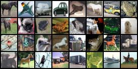
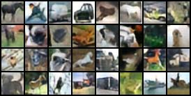

# VQ-VAE
This is a minimalistic PyTorch implementation of [Neural Discrete Representation Learning](https://arxiv.org/pdf/1711.00937.pdf) (VQ-VAE) for CIFAR10 dataset

# Usage 
Training with default hyperparameters for CIFAR10

`python main.py --train`

For testing on validation data of CIFAR10

`python main.py --test`

For reconstructing sample images 

`python main.py --generate`

## Hyperparameters

```parser.add_argument("--batch_size", type=int, default=32)
  parser.add_argument("--num_updates", type=int, default=25000)
  parser.add_argument("--n_hiddens", type=int, default=128)
  parser.add_argument("--n_residual_hiddens", type=int, default=32)
  parser.add_argument("--n_residual_layers", type=int, default=2)
  parser.add_argument("--embedding_dim", type=int, default=64)
  parser.add_argument("--n_embeddings", type=int, default=512)
  parser.add_argument("--beta", type=float, default=.25)
  parser.add_argument("--learning_rate", type=float, default=1e-3)
  parser.add_argument("--log_interval", type=int, default=100)
  parser.add_argument("--ckpt_interval", type=int, default=1000)
  parser.add_argument("--seed", type=int, default=1)
 ```

# Results
Reconstruction of sample images from Validation data of CIFAR10 after training for 24000 batches of training data with default hyperparameters

|Original | Reconstructed |
| ---| ---|
|||

# Acknowledgement
Referenced code form [MishaLaskin's vqvae](https://github.com/MishaLaskin/vqvae) implementation


